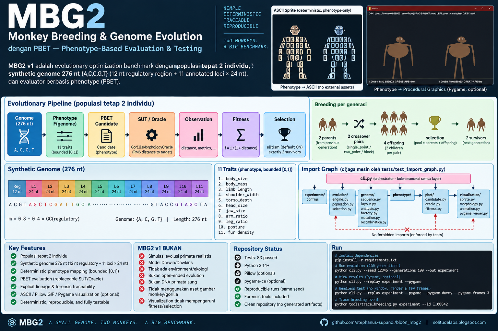

# MBG2 — Monkey Breeding & Genome Evolution
## dengan PBET — Phenotype-Based Evaluation & Testing



**MBG2 v1** adalah evolutionary optimization benchmark dengan populasi **tepat 2 individu**,
synthetic genome 276 nt `{A,C,G,T}` (12 nt regulatory region + 11 annotated loci × 24 nt),
dan evaluator berbasis phenotype (PBET).

> **SIMPLE · DETERMINISTIC · TRACEABLE · REPRODUCIBLE**

### MBG2 v1 BUKAN

- simulasi evolusi primata realistis
- model Darwin/Dawkins dengan environment, ekologi, atau open-ended evolution
- DNA primata sungguhan

Pipeline inti:

```text
Genome
  ↓
Phenotype
  ↓
PBET Candidate
  ↓
SUT / Oracle
  ↓
Observation
  ↓
Fitness
  ↓
Selection
  ↓
2 survivors
  ↓
next generation
```

Breeding per generasi:

```text
2 parents
   ↓
2 crossover pairs
   ↓
4 offspring
   ↓
selection
(pool = parents + offspring when elitism is ON)
   ↓
2 survivors
```

## Architecture

### Evolution pipeline

```text
Genome ───────► Phenotype ───────► PBET Candidate
                                      │
                                      ▼
                                 SUT / Oracle
                                      │
                                      ▼
                                  Observation
                                      │
                                      ▼
                                    Fitness
                                      │
                                      ▼
                                  Selection
                                      │
                                      ▼
                                 2 survivors
                                      │
                                      ▼
                               next generation
```

### Import graph

`tests/test_import_graph.py` enforces the dependency boundary.

```text
                         ┌──────────────────────┐
                         │       cli.py         │
                         │     orchestrator     │
                         └───────┬──────────────┘
                                 │
                 ┌───────────────┼────────────────┐
                 ▼               ▼                ▼
          experiments/        evolution/      visualization/
           configs            engine.py         sprite.py
                              population.py     morphology.py
                              selection.py      animation.py
                                   │            pygame_viewer.py
                                   │
                                   ▼
                               genome/
                                   │
                                   ▼
                              phenotype/
                                   │
                                   ▼
                                pbet/

visualization/ receives phenotype-only input.
It does not import genome, evolution, or pbet.
```

Strict dependency rules:

| Package | Allowed imports | Forbidden imports |
|---|---|---|
| `genome` | standard library | `phenotype`, `pbet`, `evolution`, `visualization` |
| `phenotype` | `genome` | `pbet`, `evolution`, `visualization` |
| `pbet` | `phenotype` | `evolution`, `visualization` |
| `evolution` | `genome`, `phenotype`, `pbet` | `visualization` |
| `visualization` | `phenotype` | `genome`, `evolution`, `pbet` |
| `cli` | all layers as orchestrator | — |

**Key principle:** every renderer (ASCII, Pillow, Pygame) receives a `phenotype` representation.
It never uses genome, fitness, generation, or target as visual input.

Archetype tags (`MONKEY-like`, `MACAQUE-like`, `GREAT-APE-like`, `GORILLA-like`) are
phenotype telemetry only and do not affect fitness, selection, mutation, or recombination.

## Genome (synthetic, 276 nt)

- 12 nt regulatory region: `m = 0.8 + 0.4 * GC(regulatory)`
- 11 loci × 24 nt, one locus per trait, annotated
- mutation: substitution per base + at most one insertion/deletion event
- fixed-length repair at the 3' end (computational simplification, not a biological indel model)
- crossover methods: `single_point`, `two_point`, `block`
- `block` cuts occur at locus boundaries
- founders are deterministic (internal seeds 1001/1002)
- `--seed` controls the stochastic evolutionary process

All genome mutation and breeding events are logged.

## Phenotype

```text
phenotype = F(genome)
trait_i = clamp01(m * weighted_locus_score_i)
```

The phenotype is deterministic and bounded to `[0,1]`, with 11 traits:

```text
body_size
body_mass
limb_length
shoulder_width
torso_depth
head_size
jaw_size
arm_ratio
leg_ratio
posture
fur_density
```

## PBET

PBET is the evaluation/testing layer, not the evolutionary algorithm:

```text
Candidate(phenotype)
        ↓
   SUT.execute()
        ↓
   Observation
        ↓
     fitness
```

The default SUT is `GorillaMorphologyOracle`, which measures RMS phenotype distance
to `GORILLA_TARGET`, followed by:

```text
fitness = 1 / (1 + distance)
```

The SUT is replaceable without changing the evolutionary engine; the test suite includes
a `ZeroOracle(SUT)` test double for this interface.

## Lineage & forensic traceability

`lineage.json` stores explicit custody information rather than reconstructing ancestry by inference.

### `lineage`

```text
individual_id → generation, parents
founder → parents = []
```

### `breeding_log`

Each breeding event records:

```text
generation
method
cut_points
parent_a
parent_b
offspring = [child1_id, child2_id]
```

The offspring list preserves crossover output order, so a child can be traced to its exact
breeding event and child index.

### `mutation_log`

Mutation events record:

```text
kind
position
before
after
locus
```

Trace an individual:

```bash
python tools/trace_breeding.py experiment --id I_00042
```

## Visualization

1. **ASCII sprite** — deterministic, phenotype-only.
2. **Pillow GIF** — optional; requires Pillow.
3. **Pygame viewer** — optional interactive viewer; requires `pygame-ce`.

**Pygame is visualization only.** It does not participate in evolutionary evaluation.

The Pygame renderer uses procedural geometry derived from phenotype traits. It does not use
monkey/gorilla image assets or image interpolation to force a visual outcome.

Generated `sprites/` and `animation/` directories are **experiment artifacts**, not source assets.

## Running

Core evolution:

```bash
python cli.py --seed 12345 --generations 10
python cli.py --seed 12345 --generations 100 --out experiment
```

Replay an existing run:

```bash
python cli.py --replay experiment
```

Pygame viewer:

```bash
python cli.py --replay experiment --pygame
```

Headless Pygame smoke test:

```bash
python cli.py --replay experiment --pygame --pygame-dummy --pygame-frames 3
```

Breeding trace:

```bash
python tools/trace_breeding.py experiment --id I_00042
```

Repository verification:

```bash
python tools/verify_repository.py
```

## Dependencies

Core MBG2 uses the Python standard library.

Optional visualization dependencies:

```text
Pillow
pygame-ce
```

Install the optional stack from `requirements.txt`:

```bash
pip install -r requirements.txt
```

> `pygame-ce` provides the `pygame` Python import used by the viewer.

## Verification snapshot

The final validation run recorded:

```text
83 tests — OK
Python 3.14
pygame-ce 2.5.8
```

A 100-generation seeded run with `seed=12345` produced:

```text
initial_best_fitness     = 0.802132
final_best_fitness       = 0.939974
initial_mean_fitness     = 0.748318
final_mean_fitness       = 0.939960
initial_genetic_distance = 0.807971
final_genetic_distance   = 0.003623
best_fitness_generation  = G098
generation_regressions   = 0
```

A no-elitism run is also part of the validation set and produced observable fitness regressions,
as expected when parents are excluded from the selection pool.

## Repository scope

The repository contains the MBG2 implementation, tests, forensic tools, documentation,
configuration, and optional visualization code.

Generated experiment outputs are intentionally kept out of the source repository.

---

## Links

- GitHub: https://github.com/stephanus-supandi/bloon_mbg2
- Project article: https://solitudelabs.blogspot.com/2026/09/dua-monyet-276-nukleotida-dan-satu.html
